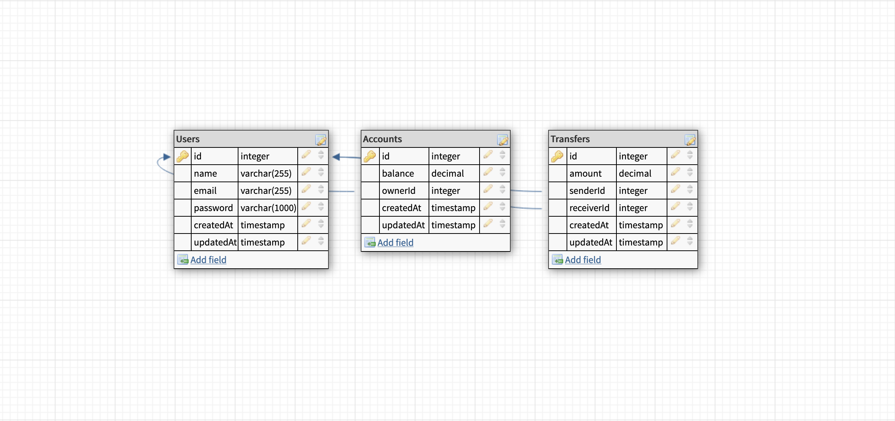

# DEMO CREDIT API

### ABOUT
Demo Credit is an API with wallet functionality. It allows users do the following:

* Register
* Create a wallet account
* Fund their wallet account
* Withdraw funds from their wallet account
* Transfer funds to another user’s wallet account

### SPEC

* Users need to register before performing any of the fundamental operations such as creating wallet accounts or transferring funds.
* After registration, a user can also login. Input sent to the registration and login APIs are all validated.
* Once the user logs in, they can create a wallet account. A user can only create one wallet account. The wallet account is linked to the user that is logged in. Input sent to the wallet account creation API is also validated, It only allows a deposit of one naira and above. Also since a user is only allowed to have one wallet account, attempting to create a second one returns an error response.
* A user can credit their wallet account as long as they have already created one prior. A users registration does not automatically mean they have a wallet. There are no limits to how much money a user can credit at once. As long as the amount is above one naira, the credit will be successful.
* A user can also withdraw funds from their wallet account as long as they have already created one prior. A users registration does not automatically mean they have a wallet. The amount to be withdrawn must exceed one naira and must also exceed the users current wallet account balance.
* A user can also initiate transfers to other users based on their wallet account id. For this to happen, a couple of things need to be validated. The receiver wallet account id must differ from the sender id, hence a user cannot transfer funds to his or her own account. Both the sender and the receiver must have an existing wallet created and the sender must have sufficient account balance to complete the transfer. There are no limits to how much funds a user can transfer at once as long as his or her balance is sufficient for the transfer. Also, Since a wallet account is tied to the logged in user, a user cannot initiate transfers for other users.
* A user can also retrieve all transfers they have sent or received.

### TECH STACK

* TypeScript
* Node.js
* Express
* MySQL
* Knex (ORM)

### SETUP
Once the repo is cloned, you will need to create a .env file based on the .env.example committed with the project.

Running ``cp .env.example .env`` on the root directory should do the trick on a POSIX based system. After that, you just need to replace the values used.

To install dependencies, run:
```
yarn
```

To get the dev server running, run:
```
yarn dev
```
This automatically runs all unapplied database migrations inside ./src/db/migrations as well as starts up the dev server.

If need be, to undo migrations run:
```
yarn rollback
```

Creating a file for your own migration is as easy as running:
```
yarn knex migrate:make name_of_migration --knexfile ./src/db/config.ts
```

This should be done at the root directory of the project otherwise the path to the knexfile config would need to be adjusted. Also once you have implemented your migration, remember to run:
```
yarn migrate
```

To run tests, use:

```
yarn test
```

To build the project and generate JavaScript Files, run:

```
yarn build
```

This will generate a dist folder which you can also use the startup the server and apply recent migrations by running:

```
yarn start
```

## ERD



## API URL

visit [here](https://caleb-oneyemi-lendsqr-be-test-hspxj.ondigitalocean.app/)

## API DOCUMENTATION

visit [here](https://documenter.getpostman.com/view/19108910/2s83zjsiiQ)
